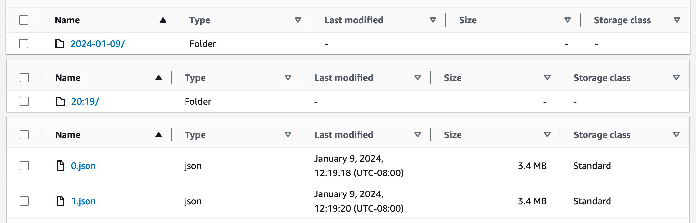

# CloudSearch Backup

**CloudSearch does not provide a backup/ restore function**. This project includes a Lambda function to backup and restore a CloudSearch index to JSON document(s) in S3.

* CloudSearchBackupFunction - backup a CloudSearch instance to JSON document(s) in S3

⚠️ Limitations: this function relies on [ephemeral storage](https://aws.amazon.com/blogs/compute/using-larger-ephemeral-storage-for-aws-lambda/) which is limited to 10GB. EFS could be used if files > 10GB are needed.

This function has **no external dependencies**, except the AWS SDK v3 that comes bundles with the NodeJS 20 Lambda runtime.



## Environment Variables

* BucketName - S3 Bucket name for backup & restore
* DocumentEndpoint - CloudSearch document endpoint for backup & restore
* OneShot - if true, overwrite backups. If false, use timestamps for unique historical entries
* SingleFile - if true, backup to a single JSON file. If false, backup to multiple batch files

## Performance

Non-scientific observations: during testing, CloudSearchBackupFunction consistently backed up 569,728 documents in 57 batches of 10,000 totalling ~200mb of raw data in ~75 seconds, from a cold start with 512mb memory.

Limitations: currently, batches are processed in series. Times can be decreased (to some extent) by tuning `MemorySize` (RAM + vCPU). Future versions could queue document batch writes to S3 while polling CloudSearch.

## SAM Overview

- `src` - Code for the application's Lambda function.
- `events` - Invocation events that you can use to invoke the function.
- `__tests__` - Unit tests for the application code. 
- `template.yaml` - A template that defines the application's AWS resources.

## Deploy the sample application

To use the AWS SAM CLI, you need the following tools:

* AWS SAM CLI - [Install the AWS SAM CLI](https://docs.aws.amazon.com/serverless-application-model/latest/developerguide/serverless-sam-cli-install.html).
* Node.js - [Install Node.js 20](https://nodejs.org/en/), including the npm package management tool.
* Docker - [Install Docker community edition](https://hub.docker.com/search/?type=edition&offering=community).

To build and deploy your application for the first time, run the following in your shell:

```bash
sam build
sam deploy --guided
```

## Use the AWS SAM CLI to build and test locally

Build using the `sam build` command.

```bash
cloudsearch-backup$ sam build
```

Run functions locally and invoke them with the `sam local invoke` command.

```bash
cloudsearch-backup$ sam local invoke helloFromLambdaFunction --no-event
```

## Fetch, tail, and filter Lambda function logs

`sam logs` lets you fetch logs that are generated by your Lambda function from the command line

```bash
cloudsearch-backup$ sam logs -n helloFromLambdaFunction --stack-name sam-app --tail
```

## Unit tests

```bash
cloudsearch-backup$ npm install
cloudsearch-backup$ npm run test
```

## Cleanup

To delete the sample application that you created, use the AWS CLI.

```bash
sam delete --stack-name cloudsearch-backup
```
